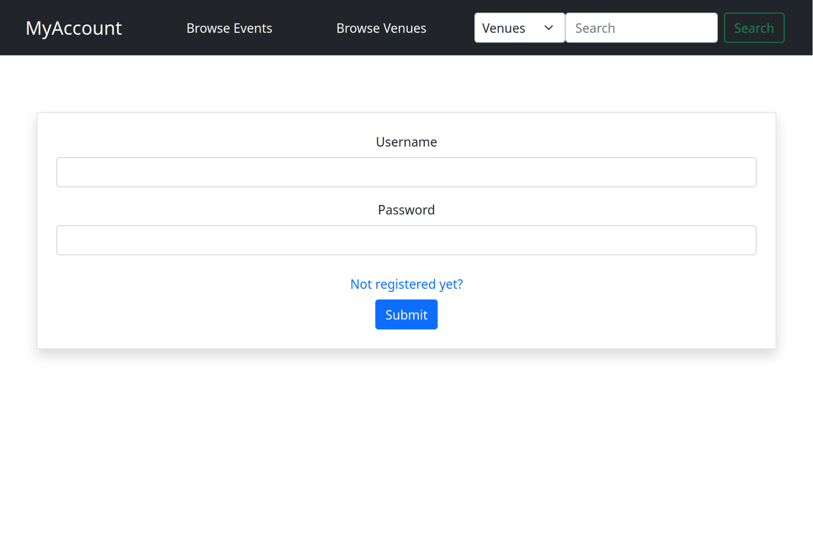
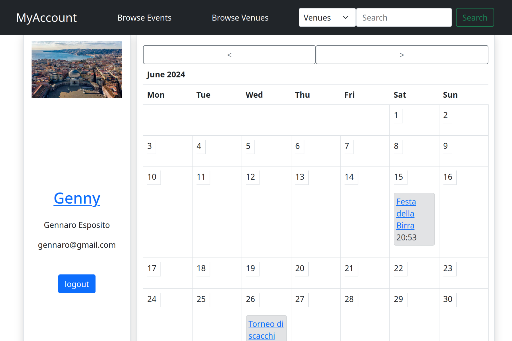
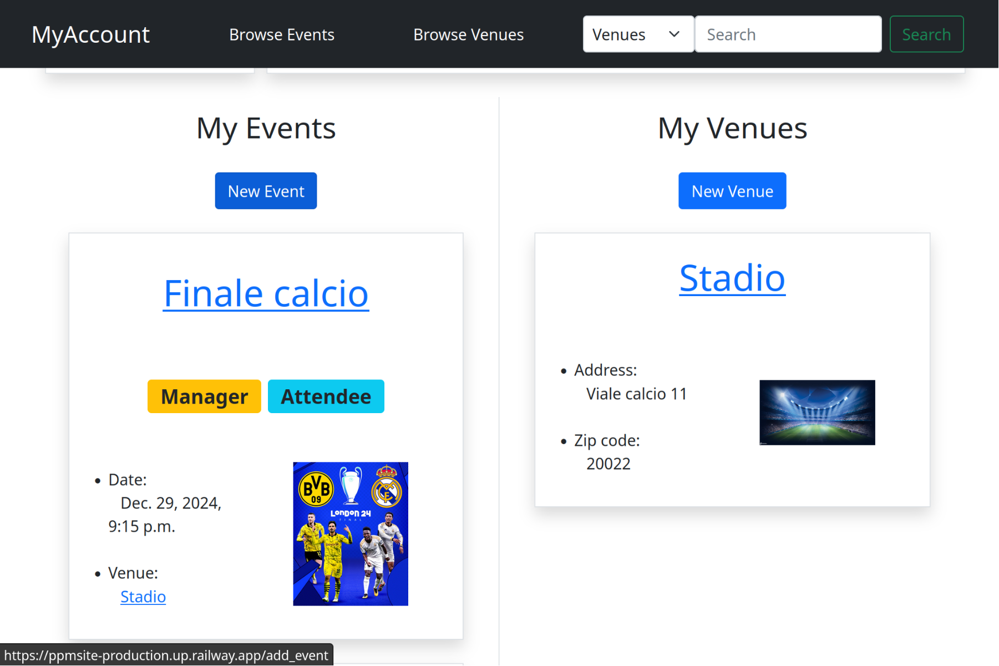
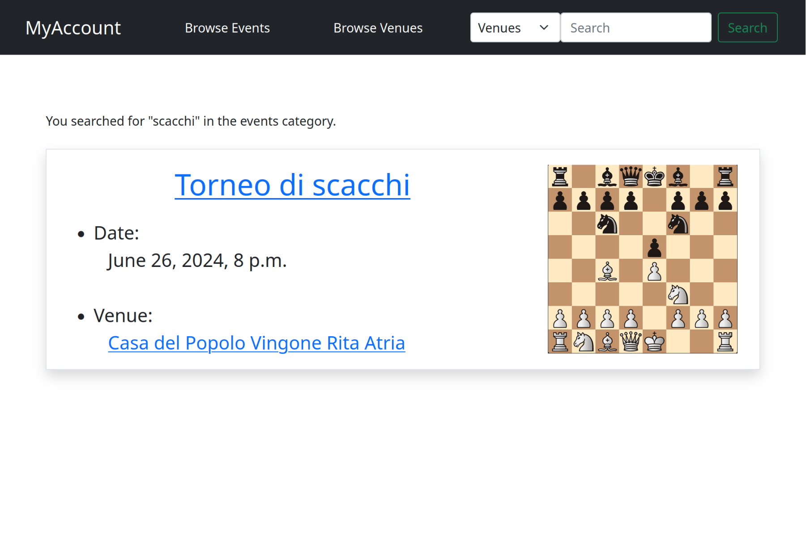
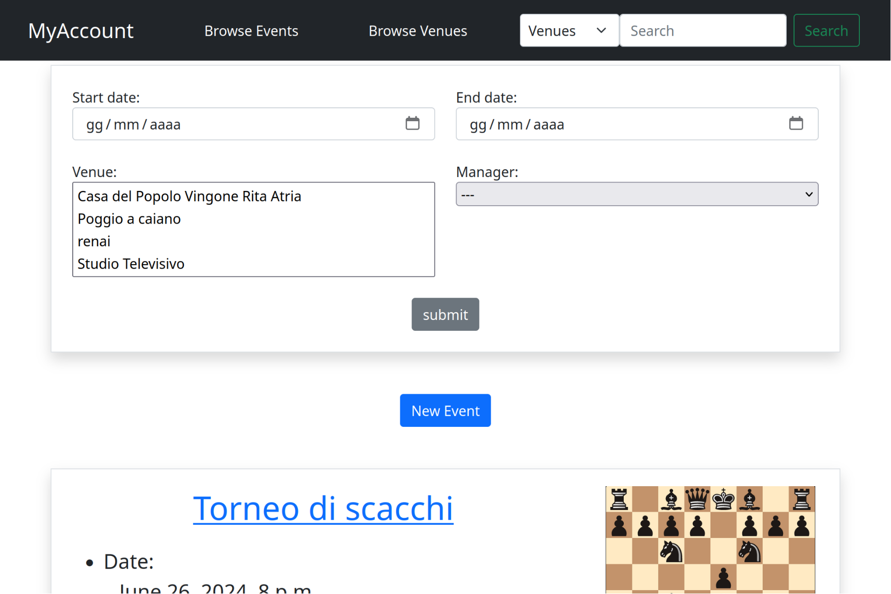
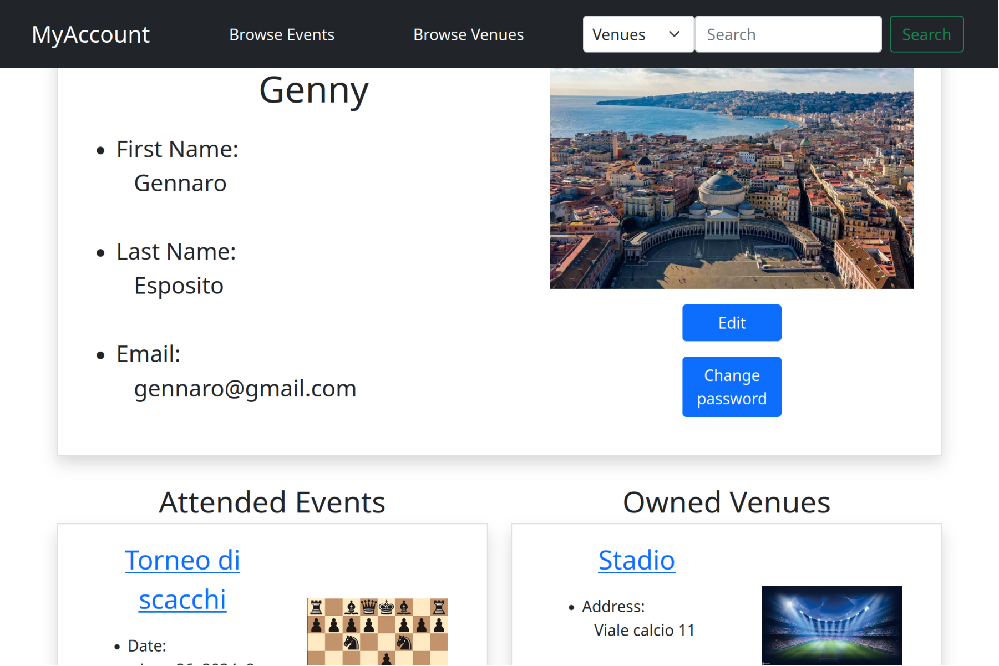

## Funzionalità del sito web

Questo sito web è un calendario online che consente agli utenti di visualizzare e prenotare eventi. Le funzionalità principali del sito includono:

   
* **Registrazione:**
    
    * per accedere ad alcune pagine del sito ed utilizzarne tutte le funzionalità è necessario fare un account e loggarsi  
* **Home Page:**
   * Calendario:
       

       * Visualizzazione del calendario in modalità mensile
       * Navigazione tra i diversi mesi e anni
       * Visualizzazione degli eventi come icone colorate (blu se si è manager del evento, grigia se si è solo iscritti)
       * Visualizzazione dei dettagli dell'evento cliccando su di esso

   * Profilo:
       
       * Visualizzazione dati del proprio profilo
       * bottone per il logout
   * Eventi e Luoghi:
       * Visualizzazione degli eventi e dei luoghi dei quali si è proprietari, o degli eventi ai quali si è iscritti

* **Barra di ricerca:**
    
    * Utilizzo della barra di ricerca per trovare eventi e luoghi per parola chiave
    * Visualizzazione dei risultati della ricerca come elenco di risultati
* **Lista degli eventi e dei luoghi:**
    
    * Navigazione tra gli eventi ed i luoghi publicati sul sito
    * Possibilità di filtrare i risultati in base ai campi degli oggetti
    * Bottone per l'aggiunta di nuovi elementi sul sito
* **Visualizzazione di singoli eventi, luoghi e utenti:**
    
    * Visualizzazioni della specifica istanza e dei suoi dati
    * Possibilità di modifica/rimozione del istanza se se ne è il proprietario
    * In caso si stia visualizzando un evento è possibile iscriversi al evento

